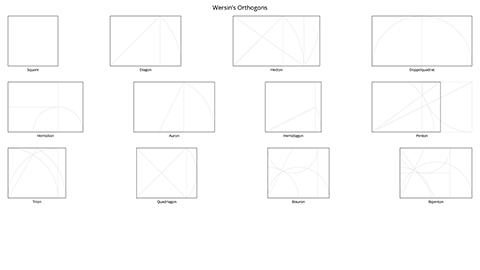

# Composition Guides

A collection of various visual composition guides in vector format. Exported
SVG versions are in the `dist` directory, and original Adobe Illustrator files
are in the `src` directory.

The composition guides are organized into the following categories:

- Dynamic Rectangles
- Golden Ratio
- Wersin's orthogons (with construction lines)
- Photography
- General aspect ratio rectangles

## Previews

### Dynamic Rectangles

### Golden Ratio

### Orthogons

### Photography

### Ratios

## License

This project is released into the Public Domain. In regions with no Public
Domain, it is offered under the 
[CC0 1.0 Universal license](https://creativecommons.org/publicdomain/zero/1.0/).
